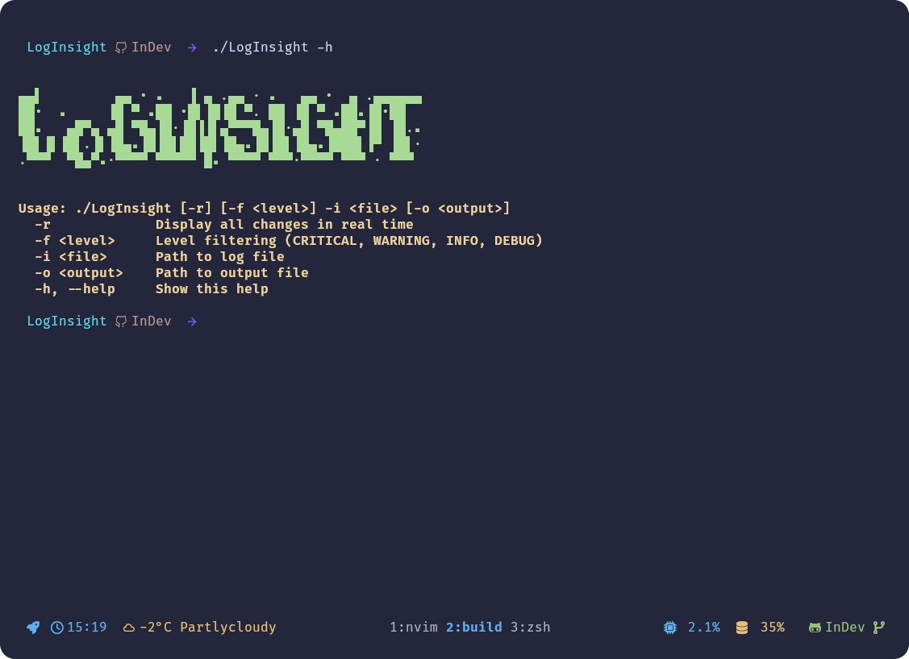
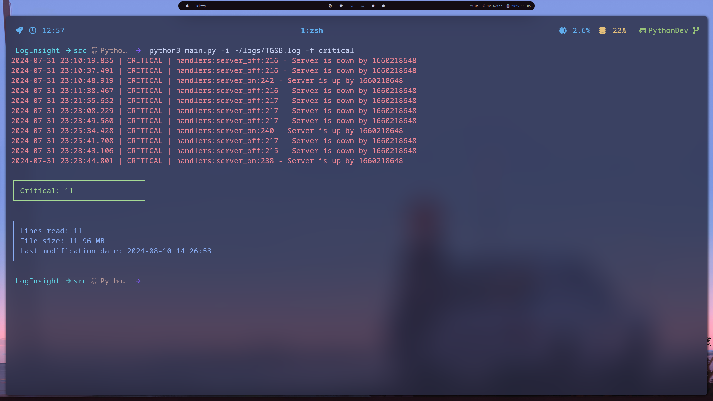

<div align="center">

# LogInsight



### Program for analyzing log files and detecting anomalies in program operation


#### Installing:

</div>

```bash
git clone https://github.com/Nighty3098/LogInsight
cd LogInsight
make
./LogInsight
```

<div align="center">

#### Usage

</div>

```
Usage: ./LogInsight [-r] [-f <level>] -i <file>
  -r             Display all changes in real time
  -f <level>     Level filtering (CRITICAL, WARNING, INFO, DEBUG)
  -i <file>      Path to log file
  -h, --help     Show this help
```

