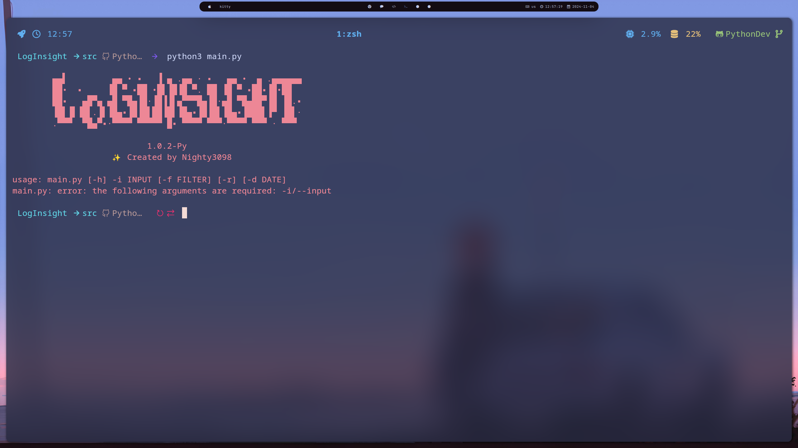

<div align="center">

# LogInsight


### Program for analyzing log files and detecting anomalies in program operation

<br><br>
<a href="./LICENSE.md"></a><br>


<br>


</div>

#### Installing:

```bash
git clone https://github.com/Nighty3098/LogInsight
cd LogInsight
python3 -m venv LI
source LI/bin/activate
pip3 install -r requirements.txt
cd src
```

#### USAGE

```
python3 main.py -h
```

<div align="center">

#### Usage

</div>

```
Usage: ./LogInsight [-r] [-f <level>] -i <file>
  -r             Display all changes in real time
  -f <level>     Level filtering (CRITICAL, WARNING, INFO, DEBUG)
  -i <file>      Path to log file
  -h, --help     Show this help
```

<br><br><br>




